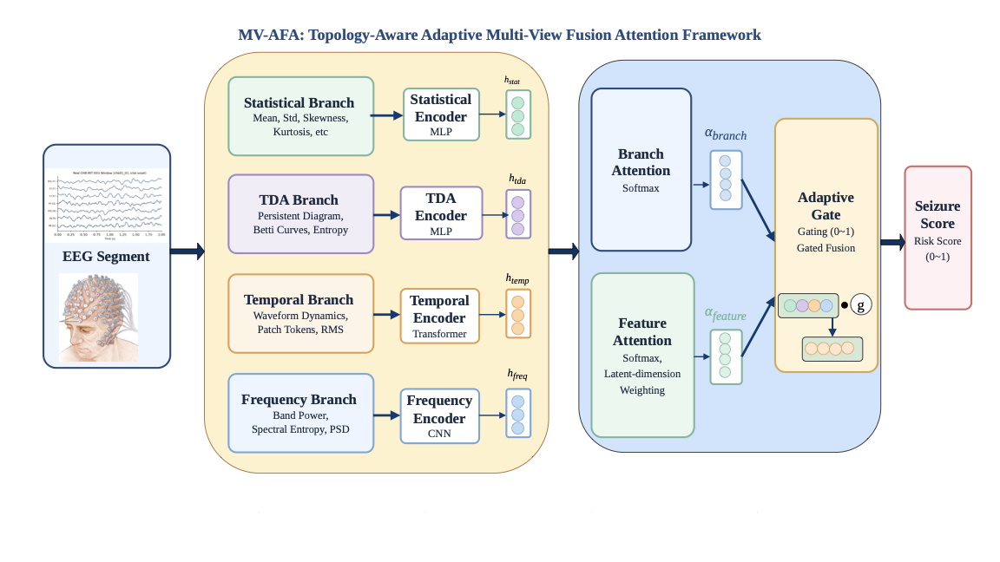

# MV-AFA: Interpretable Topology-Aware Multi-View Adaptive Fusion Attention for EEG Seizure Detection

> **BioCAS 2026 Submission** · Benchmark Repository

This repository hosts the **benchmark reimplementations** used to evaluate our proposed MV-AFA framework against four state-of-the-art EEG seizure detection methods. Since no baseline code was publicly available, we reimplemented each model from its reported architectural details. All methods were evaluated under a unified protocol covering preprocessing, channel selection, windowing, and data partitioning, with baseline architectures preserved as published. 
(As the work is still unpublished, the model details and the contents of the manuscript are being kept confidential.)

---

## Overview

Automated seizure detection from scalp EEG remains a clinically significant but technically challenging task. Current approaches either focus narrowly on a single signal representation (temporal, spectral, or spatial) or sacrifice interpretability for performance.

**MV-AFA** addresses these limitations through a topology-aware, multi-view architecture that jointly processes four complementary EEG representations and adaptively fuses them via a two-level attention mechanism.

---

## MV-AFA Architecture



### Framework Design

MV-AFA processes each EEG segment through **four parallel branches**, each capturing a distinct aspect of seizure-related brain activity:

| Branch | Features | Encoder |
|--------|----------|---------|
| **Statistical Branch** | Mean, Std, Skewness, Kurtosis, etc. | MLP |
| **TDA Branch** | Persistent Diagrams, Betti Curves, Entropy | MLP |
| **Temporal Branch** | Waveform Dynamics, Patch Tokens, RMS | Transformer |
| **Frequency Branch** | Band Power, Spectral Entropy, PSD | CNN |

Each branch produces a latent embedding (*h_stat*, *h_tda*, *h_temp*, *h_freq*).

### Adaptive Fusion

The four branch embeddings are fused through a **two-level attention mechanism**:

1. **Branch Attention** — Softmax-based weighting (*α_branch*) dynamically prioritises the most informative branch for each input window.
2. **Feature Attention** — Latent-dimension weighting (*α_feature*) selectively emphasises discriminative feature dimensions.
3. **Adaptive Gate** — A learned scalar gate *g* ∈ [0, 1] modulates the fused representation before the final classification head.

The output is a continuous **Seizure Score** (risk score ∈ [0, 1]), enabling both binary detection and severity-graded clinical alerts.

### Key Properties

- **Interpretable** — Branch attention weights reveal *which* signal view drives each prediction.
- **Topology-aware** — The TDA branch captures shape-level signal structure invisible to standard features.
- **Cross-subject generalisation** — Evaluated under strict patient-independent protocols.

---

## Benchmark Methods

Four representative prior works are reproduced as controlled baselines. Each method is implemented in its own subfolder under [`benchmark/`](benchmark/).

| Folder | Paper | Venue | Model |
|--------|-------|-------|-------|
| [`Xu2026_GAT_Transformer/`](benchmark/Xu2026_GAT_Transformer/) | Xu et al. 2026 | *Frontiers in Neurology* | Graph Attention Network + Transformer |
| [`Ghosh2026_MultiDomain_ML/`](benchmark/Ghosh2026_MultiDomain_ML/) | Ghosh et al. 2026 | *Discover Applied Sciences* | Multi-domain features + Random Forest / KNN / SVM |
| [`Li2025_CMFViT/`](benchmark/Li2025_CMFViT/) | Li et al. 2025 | *Journal of Translational Medicine* | CNN + Vision Transformer (CMFViT) |
| [`PSD_LW_DCN_2026/`](benchmark/PSD_LW_DCN_2026/) | Gu et al. 2026 | *Scientific Reports* | PSD + Lightweight 1D-DCN |

---

## Datasets

Three publicly available EEG datasets are used. See [`data/README.md`](data/README.md) for full descriptions and download instructions.

| Dataset | Subjects | Channels | Sampling Rate | Task |
|---------|----------|----------|---------------|------|
| **CHB-MIT** | 24 paediatric | 18–23 | 256 Hz | Seizure detection |
| **Siena Scalp EEG** | 14 adults | 19–29 | 512 Hz | Seizure detection |
| **TUSZ (TUH)** | 675 | 20–128 | 250 Hz | Seizure detection |

---

## Repository Structure

```
MV-AFA-EEG-Seizure-Benchmark/
├── README.md                              ← This file
├── assets/
│   └── mv_afa_architecture.png            ← MV-AFA framework diagram
├── benchmark/
│   ├── Xu2026_GAT_Transformer/
│   │   ├── README.md
│   │   └── baseline_xu_gat_transformer_chbmit.py
│   ├── Ghosh2026_MultiDomain_ML/
│   │   ├── README.md
│   │   └── baseline_ghosh_chbmit.py
│   ├── Li2025_CMFViT/
│   │   ├── README.md
│   │   └── baseline_li_cmfvit_chbmit.py
│   └── PSD_LW_DCN_2026/
│       ├── README.md
│       └── baseline_psd_lw_dcn_chbmit.py
└── data/
    └── README.md                          ← Dataset descriptions & download links
```

---

## Environment Setup

```bash
pip install torch torchvision mne numpy scipy scikit-learn pywavelets pandas matplotlib
```

For the GAT+Transformer baseline, also install:
```bash
pip install torch-geometric torch-scatter torch-sparse
```

---

## Running the Benchmarks

Each baseline can be run independently. Example commands:

```bash
# Xu 2026 — GAT + Transformer (single subject)
python benchmark/Xu2026_GAT_Transformer/baseline_xu_gat_transformer_chbmit.py \
    --data_dir ./data/CHB-MIT-scalp-eeg-database-1.0.0 \
    --subject chb01 --output_dir ./outputs/xu2026

# Ghosh 2026 — Multi-domain features (all subjects)
python benchmark/Ghosh2026_MultiDomain_ML/baseline_ghosh_chbmit.py \
    --data_dir ./data/CHB-MIT-scalp-eeg-database-1.0.0 \
    --subject all --classifiers rf knn svm --balance_train \
    --output_dir ./outputs/ghosh2026

# Li 2025 — CMFViT (patient-independent split)
python benchmark/Li2025_CMFViT/baseline_li_cmfvit_chbmit.py \
    --data_dir ./data/CHB-MIT-scalp-eeg-database-1.0.0 \
    --subject_id all --split_mode patient_independent \
    --input_mode tqwt --precompute_tqwt \
    --output_dir ./outputs/li2025

# PSD-LW-DCN 2026 — leave-one-out
python benchmark/PSD_LW_DCN_2026/baseline_psd_lw_dcn_chbmit.py \
    --data_dir ./data/CHB-MIT-scalp-eeg-database-1.0.0 \
    --split_mode loocv --test_subject chb01 \
    --output_dir ./outputs/psd_lw_dcn
```

---

## Citation

If you use any of the benchmark implementations in your work, please cite the corresponding original papers. The MV-AFA paper citation will be added upon publication.

---

## License

The benchmark implementations are released under the **MIT License** for research purposes.  
The MV-AFA model design and paper content are **not included** in this repository and remain confidential pending publication.
